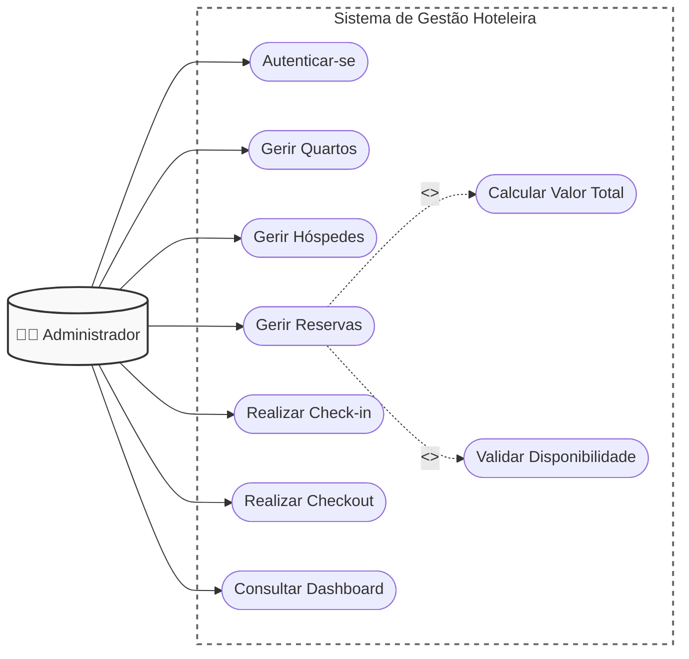
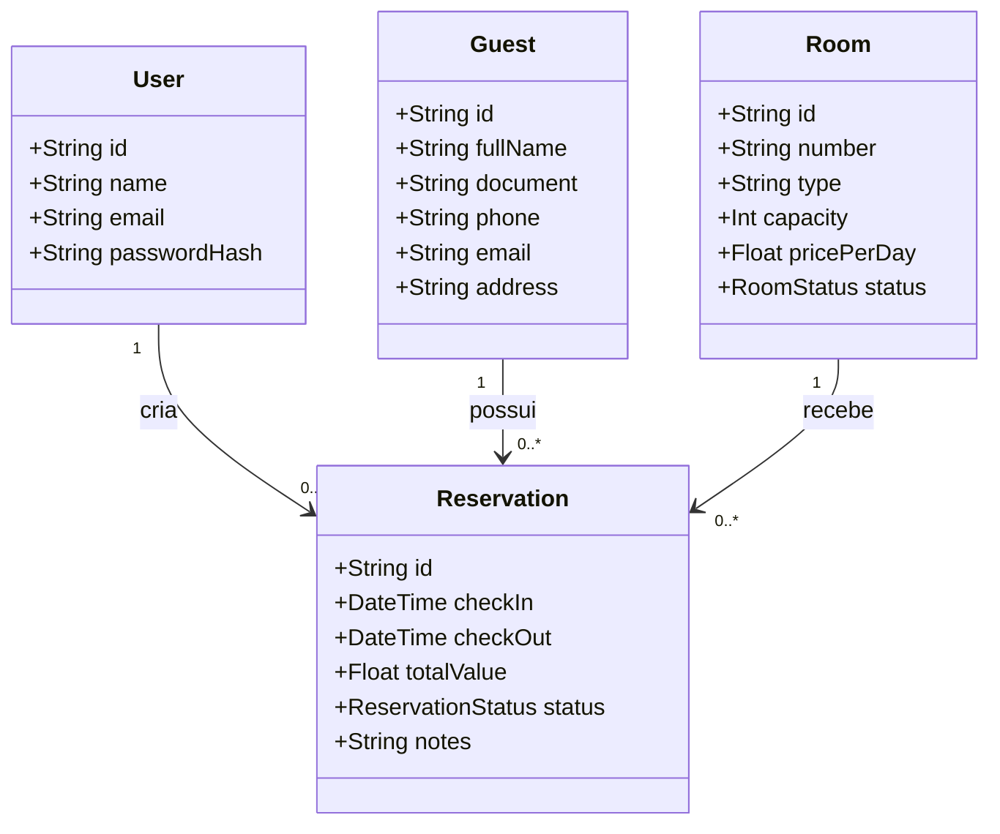
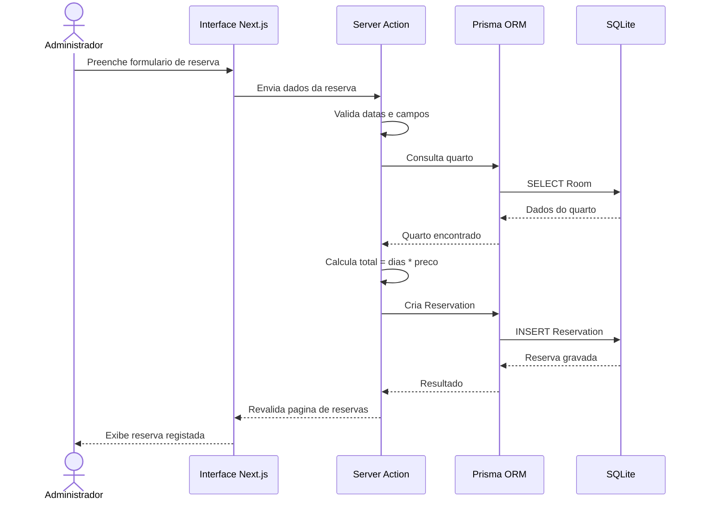
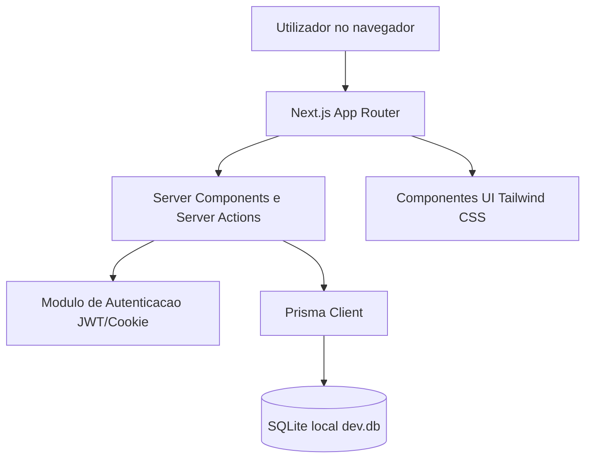
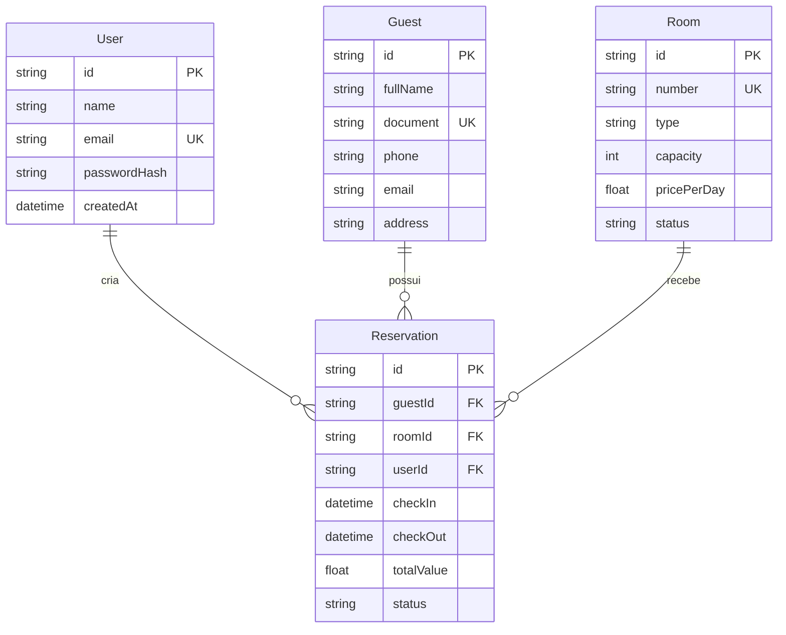
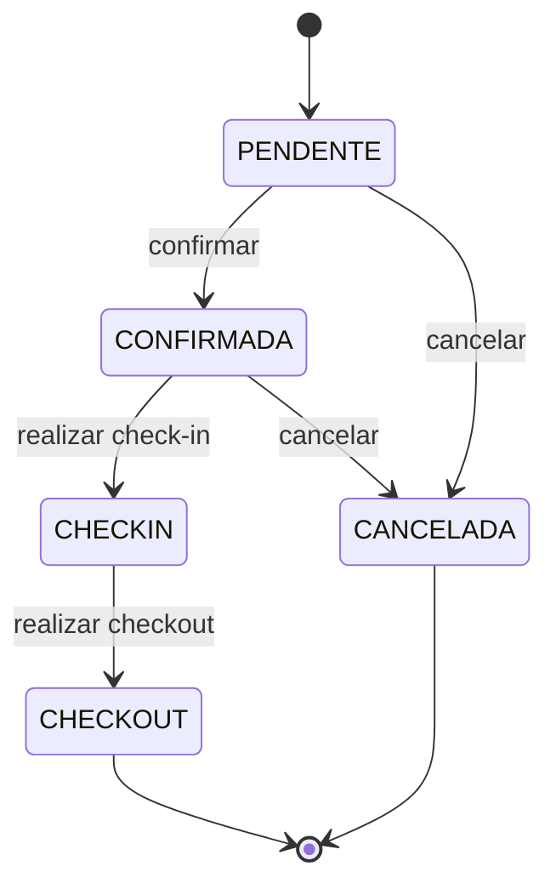
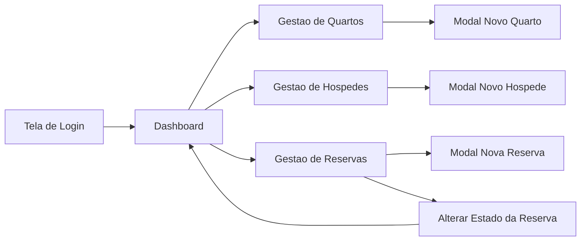
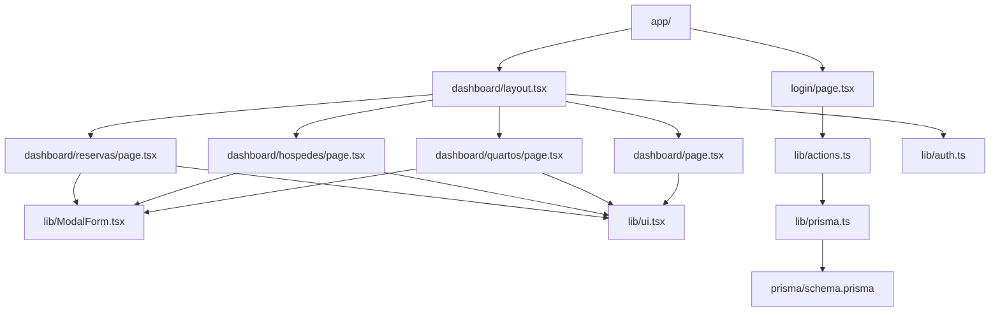

# AVALIACAO III DE DESENVOLVIMENTO DE APLICATIVOS WEB EMPRESARIAIS
 
**FACULDADE**: FACULDADE DE ECONOMIA E GESTÃO.   
**Curso:** Gestao de Sistemas de Informacao - UnISCED   
**Disciplina**: Desenvolvimento De Aplicativos Web Empresariais   
**Tema**: Desenvolvimento de um Sistema Web Empresarial para Gestão de Hotel/Pensão - HotelGuest Manager   

**Discente**: Jorge Mabjaia   
**Docente**: Msc Carlitos Chitsumba

## 1. Levantamento de Requisitos

### Requisitos funcionais

| Codigo | Requisito |
| --- | --- |
| RF01 | O sistema deve permitir login de utilizadores autorizados por email e palavra-passe. |
| RF02 | O sistema deve permitir terminar sessao do utilizador autenticado. |
| RF03 | O sistema deve permitir cadastrar, listar, editar e eliminar quartos. |
| RF04 | O sistema deve permitir alterar o estado do quarto para Livre, Ocupado ou Manutencao. |
| RF05 | O sistema deve permitir cadastrar, listar, editar e eliminar hospedes. |
| RF06 | O sistema deve permitir pesquisar hospedes por nome ou documento/BI. |
| RF07 | O sistema deve permitir criar reservas, associando hospede, quarto, datas e valor total calculado. |
| RF08 | O sistema deve exibir dashboard com taxa de ocupacao, reservas ativas e receitas. |

### Requisitos nao funcionais

| Codigo | Requisito |
| --- | --- |
| RNF01 | O sistema deve responder rapidamente em ambiente local, com consultas simples ao SQLite. |
| RNF02 | A interface deve ser responsiva para computador, tablet e telemovel. |
| RNF03 | A autenticacao deve usar cookie HTTP-only assinado por JWT local. |
| RNF04 | O sistema deve ser standalone, usando SQLite sem dependencia de servicos externos. |
| RNF05 | A interface deve ser simples, clara e adequada a utilizadores administrativos. |

## 2. Modelacao UML

### a) Diagrama de Casos de Uso

### b) Descricao detalhada de casos de uso

| Caso de uso | Manter Reserva |
| --- | --- |
| Ator principal | Administrador |
| Pre-condicoes | Utilizador autenticado; quarto e hospede cadastrados. |
| Fluxo principal | 1. O administrador abre Reservas. 2. Seleciona hospede e quarto. 3. Informa check-in e checkout. 4. O sistema valida datas. 5. O sistema calcula o valor total com base no preco diario. 6. O sistema grava a reserva. |
| Fluxo alternativo | Se checkout for anterior ou igual ao check-in, o sistema rejeita a operacao. |
| Pos-condicoes | Reserva registada com estado Pendente, Confirmada ou Check-in. |

| Caso de uso | Realizar Check-in |
| --- | --- |
| Ator principal | Administrador |
| Pre-condicoes | Reserva existente e quarto nao em manutencao. |
| Fluxo principal | 1. O administrador localiza a reserva. 2. Seleciona o estado Check-in. 3. O sistema atualiza a reserva. 4. O sistema marca o quarto como Ocupado. |
| Fluxo alternativo | Se a reserva estiver cancelada, o administrador deve criar nova reserva. |
| Pos-condicoes | Reserva em Check-in e quarto ocupado. |

### c) Diagrama de Classes

### d) Diagrama de Sequencia - Fluxo de Reserva de Quarto

### e) Diagrama de Implantacao / Arquitetura

### f) Diagrama Entidade-Relacionamento

### g) Diagrama de Estados da Reserva

### h) Diagrama de Navegacao da Interface

### i) Diagrama de Componentes de Codigo

## 3. Arquitetura do Sistema

O sistema utiliza a arquitetura do Next.js App Router, na qual as rotas sao organizadas dentro da pasta `app`. As paginas do dashboard sao Server Components, permitindo consultar diretamente a base de dados no servidor e entregar HTML ja preenchido ao navegador. Operacoes de escrita, como criar quarto, editar hospede e alterar estado de reserva, sao implementadas por Server Actions no ficheiro `lib/actions.ts`.

A autenticacao usa email e palavra-passe. A palavra-passe e armazenada como hash gerado por bcrypt, e a sessao e mantida por cookie HTTP-only assinado com JWT local. O layout do dashboard chama `requireUserId()`, garantindo que paginas administrativas so sejam acessadas por utilizadores autenticados.

A camada de dados e isolada por Prisma ORM, que fornece acesso tipado a SQLite. Esta separacao facilita manutencao, reduz SQL manual e aproxima o codigo da modelacao orientada a objetos exigida pela disciplina.

## 4. Base de Dados

A base de dados relacional SQLite contem quatro entidades principais:

- `User`: utilizadores administrativos.
- `Room`: quartos com numero, tipo, capacidade, preco diario e estado.
- `Guest`: hospedes com nome, documento, telefone, email e endereco.
- `Reservation`: reservas relacionadas a hospede, quarto e utilizador.

Relacionamentos principais:

- Um utilizador pode criar varias reservas.
- Um hospede pode possuir varias reservas.
- Um quarto pode participar em varias reservas ao longo do tempo.
- Uma reserva pertence a um unico hospede, um unico quarto e um unico utilizador.

O esquema esta implementado no ficheiro `prisma/schema.prisma`. Como o conector SQLite do Prisma nao suporta enums nativos, os estados foram armazenados como `String` e validados na camada de negocio com Zod, garantindo valores padronizados como `LIVRE`, `OCUPADO`, `MANUTENCAO`, `PENDENTE`, `CONFIRMADA`, `CHECKIN`, `CHECKOUT` e `CANCELADA`.

## 5. Desenvolvimento da Aplicacao

A aplicacao foi desenvolvida em TypeScript para reduzir erros de tipo e facilitar manutencao. O ficheiro `lib/prisma.ts` centraliza a instancia do Prisma Client. O ficheiro `lib/auth.ts` concentra a criacao, leitura e destruicao da sessao. O ficheiro `lib/actions.ts` concentra regras de negocio e validacoes com Zod.

As paginas incluem:

- `app/login/page.tsx`: formulario de autenticacao.
- `app/dashboard/page.tsx`: indicadores de ocupacao, reservas ativas e receitas.
- `app/dashboard/quartos/page.tsx`: CRUD de quartos.
- `app/dashboard/hospedes/page.tsx`: CRUD e pesquisa de hospedes.
- `app/dashboard/reservas/page.tsx`: criacao de reservas e alteracao de estado.

